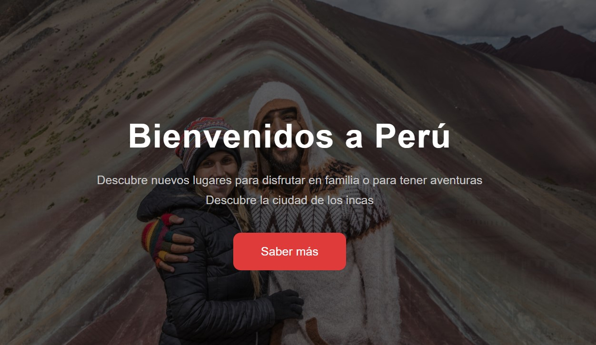

# PortfolioPersonal

## Descripción del proyecto

Este proyecto va a ser mi carta de presentación ante cualquier empresa cuando quiera acceder a un puesto de trabajo. Aquí mostraré mis habilidades, logros, etc.

## Inspiración

La fuente de inspiración de este portfolio ha sido el proyecto realizado enteriormente en el cual simulé una web de Perú, la cual ha sido implementada en la página en el apartado de proyectos.

## Planificación

Tras decidir la información que se iba a implementar, costo mucho elegir una paleta de colores oscura, pero que a la vez tuviese colores vivos que resaltasen la información mas relevante. Al final me decidi por usar negro, gris y azul para el color que resalte la información que mas relevancia tenga.

## Diseño

- **Paleta de colores**
  - Color primario : Gris
  - Color secunadrio : Negro
  - Color terciario : rgb(43, 72, 168)[Azul]

## Implementación

-En este proyecto se ha usado:
-Flexbox
-Grid
-Transiciones
-Animaciones
-Keyframes
-El uso de @media screen para que sea responsive
-Uso de JavaScript para la barra de navegación
-Uso de ids y de clases
-Extenso uso de CSS

## Resultado

El portfolio es responsive, siendo mobile first, y mostrando todo lo que debe mostrar de manera correcta y bonita

## Conclusion

Con este proyecto, ya voy a tener una "carta" de presentación para las empresas
